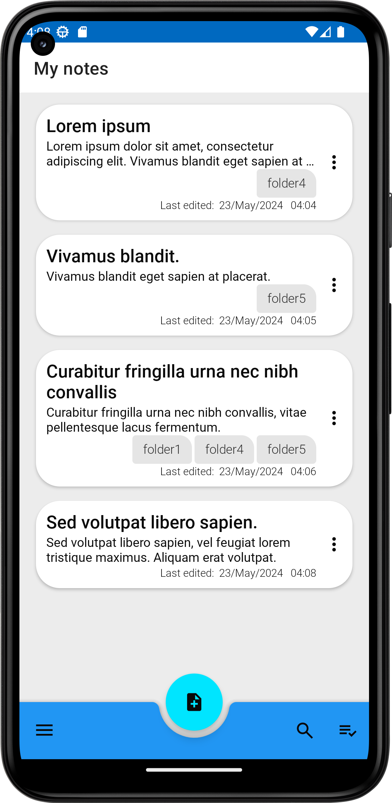
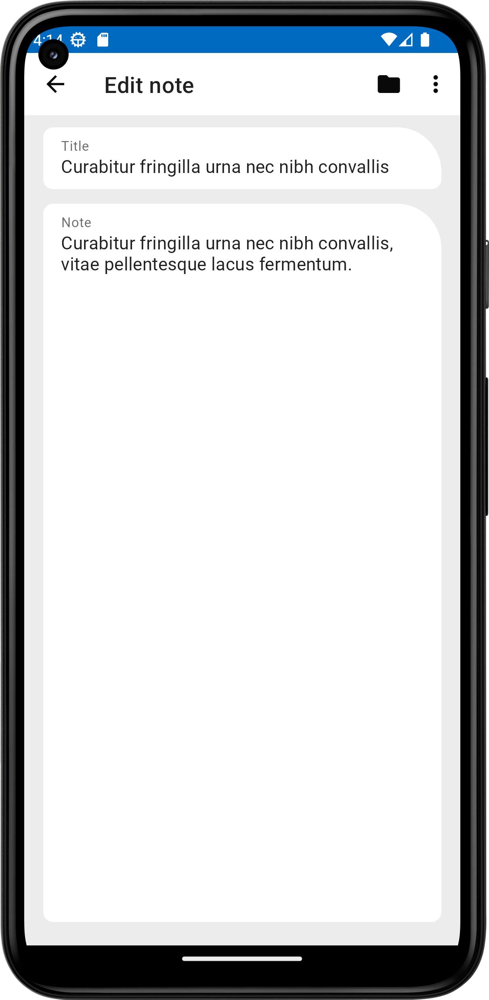

#   My Notie

An android notepad for taking notes, write what you want and save them to see them later.

### Screenshots

### Latest Release
Version 1.0.0 is ready! [Download it from here!](https://github.com/ioannis-xenakis/MyNotie/releases/download/v1.0.0/mynotie-v1.0.0.apk)

### Contribute
You're welcome to contribute to anything you want :smiley: . In fact **everyone** beginners and experts, are welcome! I'll really appreciate it if you help me. :smiley:
You can help me or contribute to my repo and give me ideas by creating a new github issue, with going to the ["Issues" tab](https://github.com/ioannis-xenakis/MyNotie/issues) from my github repo page, or from your preffered git gui editor. You can also fork the repo, make the change you want and pull request in [Develop](https://github.com/ioannis-xenakis/MyNotie/tree/Develop) branch. Thank you all! :smiley:

### License
This app/repo, is licensed by the [GNU General Public License(GPL) Version 3.](LICENSE)

### Privacy policy
[This is the privacy policy](PRIVACY_POLICY.md) that specifies if the app collects any personal data from you and if there is requested permissions that is needed from you.

### Tools/ide used
Built with Android Studio.

### Contact me
For anything you want, to contact me, don't hesitate to contact me by email, at: Xenakis.i.contact@gmail.com

  
